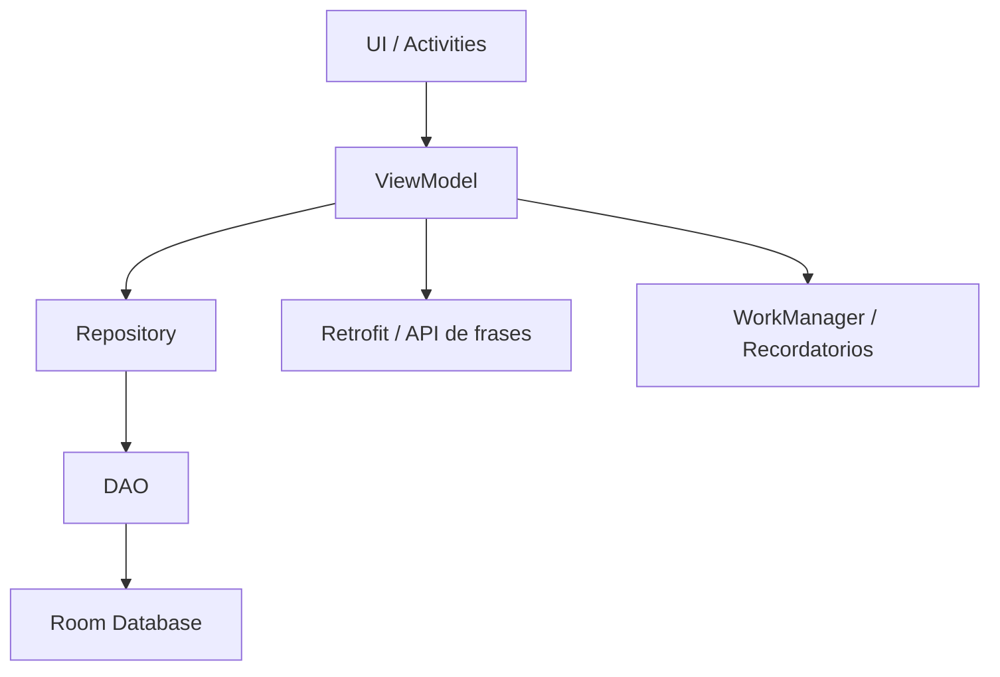
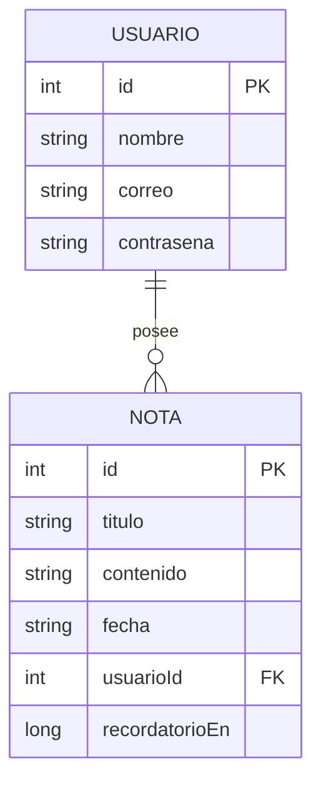

# Manual Técnico — Diario Virtual v1.0

## 1. Descripción del sistema

**Diario Virtual** es una aplicación móvil Android desarrollada para registrar y organizar recuerdos, ideas, notas personales y experiencias importantes. El sistema busca resolver el problema de pérdida o desorganización de información personal cuando el usuario guarda apuntes en varios lugares, como cuadernos, mensajes o aplicaciones separadas.

El usuario objetivo son estudiantes y personas que necesitan una herramienta sencilla, privada y rápida para guardar notas personales desde su dispositivo móvil.

### Alcance del MVP

La versión **v1.0** corresponde al MVP completo de la aplicación. Incluye las funciones esenciales necesarias para demostrar que el producto funciona correctamente:

- Registro de usuario.
- Inicio de sesión.
- Persistencia de sesión.
- Creación de notas.
- Visualización de notas.
- Edición de notas.
- Eliminación de notas.
- Planificación de notas con recordatorio.
- Consulta de frases del día mediante API externa.
- Interfaz visual mejorada.
- Pruebas básicas de validación, integración e interfaz.

La aplicación trabaja principalmente con almacenamiento local, por lo que las notas permanecen guardadas en el dispositivo mediante Room Database.

---

## 2. Arquitectura de la aplicación

La aplicación fue organizada mediante una arquitectura por capas, tomando como base el patrón **MVVM**. Esta estructura permite separar la interfaz, la lógica de presentación, la lógica de acceso a datos y la persistencia local.

### Diagrama de capas



### Descripción de capas

**UI / Activities:**  
Contiene las pantallas principales de la aplicación. Se encarga de mostrar información al usuario y capturar sus acciones. En esta capa se encuentran actividades como `LoginActivity`, `RegisterActivity`, `MainActivity`, `CrearNotaActivity` y `FraseActivity`.

**ViewModel:**  
Gestiona el estado de la pantalla y conecta la interfaz con la lógica de la aplicación. Evita que las Activities accedan directamente a la base de datos. En el proyecto se usan `NotaViewModel` y `FraseViewModel`.

**Repository:**  
Funciona como intermediario entre el ViewModel y los datos. Centraliza las operaciones relacionadas con las notas y permite que el código sea más ordenado y fácil de mantener.

**DAO:**  
Define las operaciones sobre la base de datos, como insertar, consultar, actualizar y eliminar. En el proyecto se utilizan `UsuarioDao` y `NotaDao`.

**Room Database:**  
Permite guardar la información de forma local en el dispositivo. La clase principal es `AppDatabase`.

**Retrofit / API:**  
Permite consultar frases aleatorias en español desde una API externa.

**WorkManager:**  
Permite programar recordatorios para notas planificadas a futuro.

### Patrón de diseño usado

El patrón principal utilizado es **MVVM (Model - View - ViewModel)**. Este patrón ayuda a mantener separada la interfaz visual de la lógica interna del sistema. Gracias a esto, el proyecto es más fácil de probar, corregir y ampliar.

---

## 3. Modelo de datos

El sistema utiliza dos entidades principales: `Usuario` y `Nota`. Cada usuario puede tener varias notas asociadas.

### Diagrama ER



### Entidad Usuario

La entidad `Usuario` representa a cada persona registrada en la aplicación.

| Campo | Tipo | Descripción |
|---|---|---|
| id | Int | Identificador único del usuario. |
| nombre | String | Nombre completo del usuario. |
| correo | String | Correo electrónico utilizado para iniciar sesión. |
| contrasena | String | Contraseña almacenada en formato hash. |

### Entidad Nota

La entidad `Nota` representa cada registro creado por el usuario.

| Campo | Tipo | Descripción |
|---|---|---|
| id | Int | Identificador único de la nota. |
| titulo | String | Título de la nota. |
| contenido | String | Contenido escrito por el usuario. |
| fecha | String | Fecha asociada a la nota. |
| usuarioId | Int | Identificador del usuario dueño de la nota. |
| recordatorioEn | Long? | Fecha y hora del recordatorio, si fue planificado. |

### Relación entre entidades

La relación principal es:

**Usuario 1 — N Nota**

Esto significa que un usuario puede tener muchas notas, pero cada nota pertenece a un solo usuario. El campo `usuarioId` permite vincular cada nota con su usuario correspondiente.

---

## 4. Tecnologías y librerías

### Framework y entorno

- **Framework:** Android nativo.
- **Lenguaje:** Kotlin.
- **IDE:** Android Studio.
- **Sistema de construcción:** Gradle Kotlin DSL.
- **Application ID:** `com.larrea.myvirtualdiary`.
- **Namespace:** `com.larrea.myvirtualdiary`.
- **Versión de la app:** `1.0`.
- **Version Code:** `1`.
- **Compile SDK:** 36.
- **Target SDK:** 36.
- **Min SDK:** 24.
- **Java:** 11.

### Librerías principales

| Librería | Versión | Uso dentro del proyecto |
|---|---:|---|
| AndroidX Core KTX | 1.18.0 | Funciones base de Android con Kotlin. |
| AppCompat | 1.7.1 | Compatibilidad de componentes Android. |
| Material Components | 1.14.0 | Botones, tarjetas, text fields y diseño visual. |
| Activity KTX | 1.13.0 | Manejo moderno de actividades. |
| ConstraintLayout | 2.2.1 | Diseño flexible de interfaces. |
| Lifecycle ViewModel KTX | 2.11.0 | Gestión de lógica de pantalla. |
| Lifecycle LiveData KTX | 2.11.0 | Observación de datos en tiempo real. |
| Lifecycle Runtime KTX | 2.11.0 | Soporte de ciclo de vida. |
| Room Runtime | 2.8.4 | Persistencia local. |
| Room KTX | 2.8.4 | Soporte de Room con Kotlin y corrutinas. |
| Room Compiler | 2.8.4 | Generación de código Room mediante KSP. |
| WorkManager KTX | 2.10.5 | Programación de recordatorios. |
| RecyclerView | 1.4.0 | Listado de notas. |
| CardView | 1.0.0 | Tarjetas visuales. |
| Retrofit | 3.0.0 | Comunicación con API externa. |
| Converter Gson | 3.0.0 | Conversión de JSON a objetos Kotlin. |
| JUnit | 4.13.2 | Pruebas unitarias. |
| Espresso | 3.7.0 | Pruebas de interfaz. |

### API externa utilizada

La aplicación utiliza una API externa de frases llamada **Quotes API**.

Endpoint usado:

```text
https://quotes-api-three.vercel.app/api/randomquote?language=es
```

Funcionamiento:

1. El usuario entra a la pantalla **Frase del día**.
2. La app usa Retrofit para hacer una solicitud HTTP.
3. La API devuelve una frase aleatoria en español.
4. Gson transforma la respuesta JSON en un objeto Kotlin.
5. El `FraseViewModel` actualiza el estado de la pantalla.
6. La frase se muestra al usuario.

Si no hay conexión o la API falla, la aplicación puede mostrar frases locales como respaldo.

### Notificaciones y permisos

La aplicación usa `WorkManager` para programar recordatorios de notas. También solicita el permiso:

```xml
<uses-permission android:name="android.permission.POST_NOTIFICATIONS" />
```

Este permiso es necesario en versiones recientes de Android para mostrar notificaciones al usuario.

---

## 5. Instrucciones para compilar

### Requisitos previos

Antes de compilar el proyecto se recomienda tener instalado:

- Android Studio actualizado.
- JDK compatible con Java 11.
- SDK de Android instalado.
- Conexión a Internet para sincronizar Gradle y consultar la API.
- Git instalado si se desea clonar el repositorio.

### Repositorio

URL del repositorio:

```text
https://github.com/MichaelLarrea/diario-virtual
```

### Pasos para compilar

1. Clonar el repositorio:

```bash
git clone https://github.com/MichaelLarrea/diario-virtual.git
```

2. Abrir Android Studio.

3. Seleccionar:

```text
File → Open
```

4. Abrir la carpeta del proyecto `diario-virtual`.

5. Esperar la sincronización de Gradle.

6. Verificar que el dispositivo o emulador esté activo.

7. Ejecutar el proyecto con:

```text
Run → Run app
```

o presionando el botón verde de ejecución en Android Studio.

### Variables de entorno

El proyecto no requiere variables de entorno especiales. Tampoco requiere archivo `google-services.json`, porque no utiliza Firebase. La API de frases es pública y se consulta mediante Retrofit.

### Generación de APK

Para generar un APK de prueba:

```text
Build → Build Bundle(s) / APK(s) → Build APK(s)
```

La salida normalmente se encuentra en:

```text
app/build/outputs/apk/debug/app-debug.apk
```

Para generar un APK firmado:

```text
Build → Generate Signed Bundle / APK → APK
```

Luego se debe crear o seleccionar un keystore y completar los datos de firma.

---

## 6. Estructura del repositorio

La estructura principal del proyecto es la siguiente:

```text
diario-virtual/
│
├── app/
│   ├── build.gradle.kts
│   ├── proguard-rules.pro
│   └── src/
│       ├── main/
│       │   ├── AndroidManifest.xml
│       │   ├── java/com/larrea/myvirtualdiary/
│       │   │   ├── LoginActivity.kt
│       │   │   ├── RegisterActivity.kt
│       │   │   ├── MainActivity.kt
│       │   │   ├── CrearNotaActivity.kt
│       │   │   ├── FraseActivity.kt
│       │   │   ├── adapter/
│       │   │   ├── api/
│       │   │   ├── data/
│       │   │   ├── notifications/
│       │   │   ├── util/
│       │   │   └── viewmodel/
│       │   └── res/
│       │       ├── drawable/
│       │       ├── drawable-nodpi/
│       │       ├── layout/
│       │       ├── menu/
│       │       ├── mipmap/
│       │       ├── values/
│       │       └── xml/
│       ├── test/
│       └── androidTest/
│
├── gradle/
│   └── libs.versions.toml
│
├── build.gradle.kts
├── settings.gradle.kts
└── README.md
```

### Carpetas principales

**app/src/main/java/com/larrea/myvirtualdiary/**  
Contiene las clases principales de la aplicación.

**adapter/**  
Contiene el adaptador `NotaAdapter`, encargado de mostrar las notas en el RecyclerView.

**api/**  
Contiene las clases relacionadas con la API de frases, como `ApiService`, `RetrofitClient`, `FraseResponse` y `ApiState`.

**data/**  
Contiene las entidades, DAOs, base de datos y repositorio de notas.

**notifications/**  
Contiene la lógica para programar y mostrar recordatorios mediante WorkManager.

**util/**  
Incluye clases auxiliares, como manejo de sesión, hash de contraseña y ajustes de interfaz.

**viewmodel/**  
Contiene los ViewModels que gestionan la lógica de pantalla.

**res/layout/**  
Contiene los archivos XML de las pantallas.

**res/drawable y drawable-nodpi/**  
Contienen fondos, iconos, imágenes y recursos visuales.

**test/**  
Contiene pruebas unitarias.

**androidTest/**  
Contiene pruebas instrumentadas e interfaz.

---

## 7. Historial de versiones

### v1.0 — 24/07/2026 — MVP completo

Primera versión estable del proyecto **Diario Virtual**.

Funcionalidades incluidas:

- Registro de usuario.
- Inicio de sesión.
- Persistencia de sesión.
- CRUD completo de notas.
- Listado de notas por usuario.
- Edición de notas.
- Eliminación de notas.
- Restauración de notas eliminadas mediante interacción.
- Frases del día en español mediante API externa.
- Frases locales como respaldo.
- Planificación de notas con fecha y hora.
- Recordatorios mediante WorkManager.
- Notificaciones locales.
- Interfaz visual rediseñada.
- Fondos personalizados en login y pantalla principal.
- Botones principales más visibles y llamativos.
- Pruebas unitarias de validaciones.
- Pruebas de integración con Room.
- Pruebas de interfaz con Espresso.
- Generación de APK para entrega.

### Estado de la versión

La versión `v1.0` se considera estable porque cumple con el alcance del MVP, sus funciones principales están implementadas y la aplicación puede ser ejecutada, probada y presentada como producto funcional.

---

## Conclusión técnica

Diario Virtual v1.0 es una aplicación Android organizada mediante arquitectura MVVM, almacenamiento local con Room Database, consumo de API mediante Retrofit y recordatorios con WorkManager. La aplicación cumple con el objetivo de registrar, organizar y recordar notas personales de forma sencilla. Además, cuenta con una interfaz visual mejorada y una estructura de código preparada para futuras ampliaciones.
